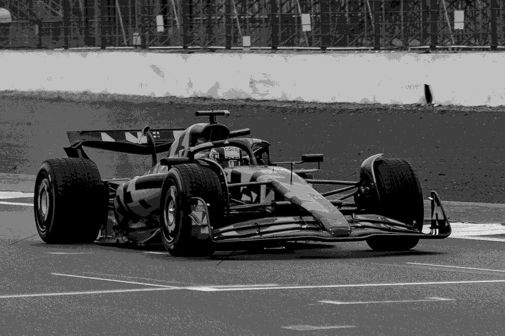
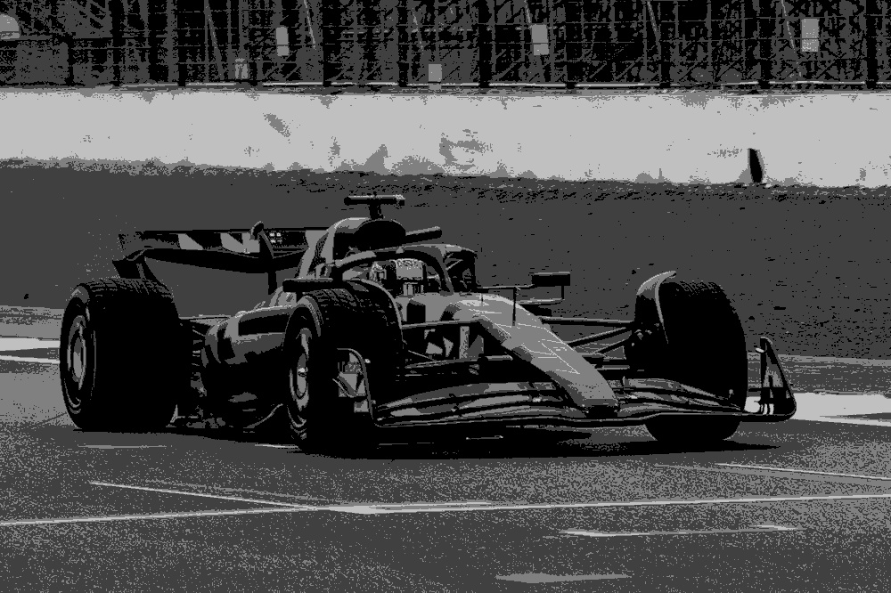
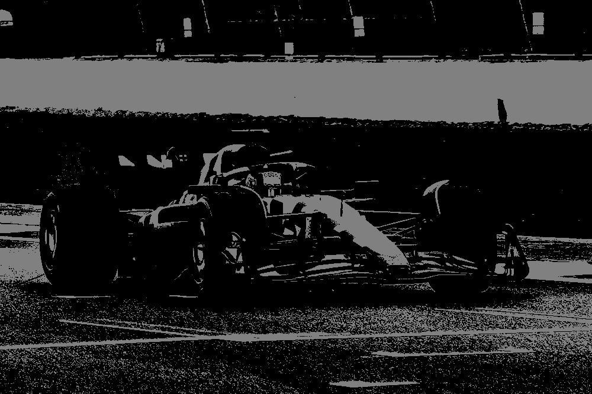
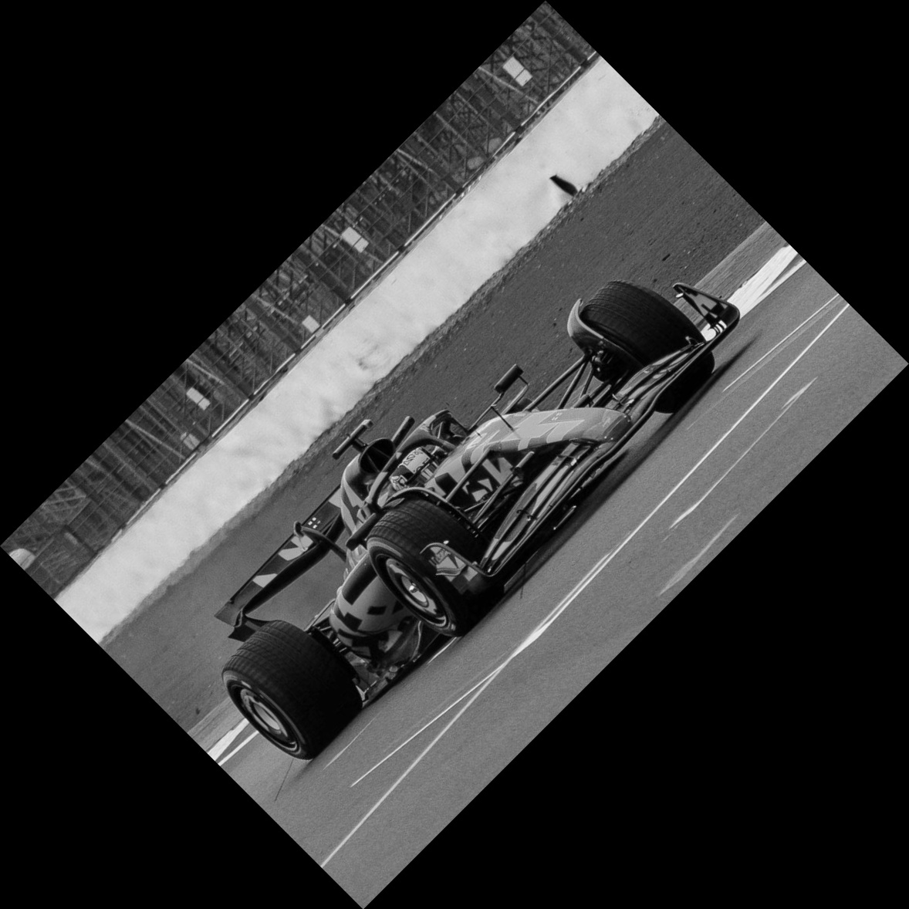
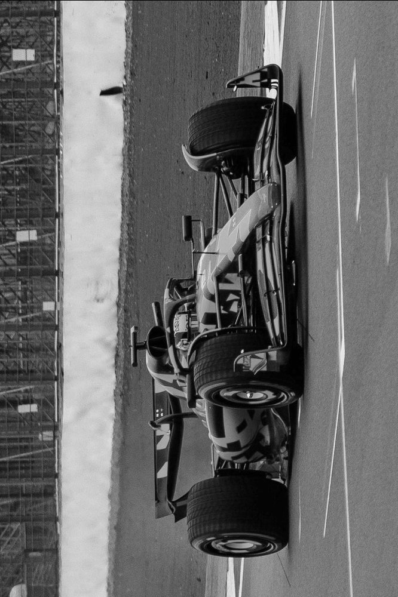
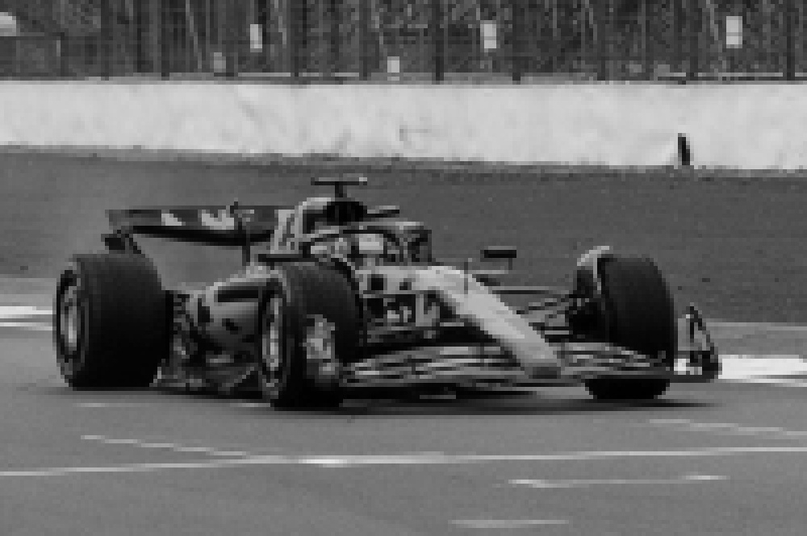

# EC7212 – Computer Vision and Image Processing

## Take Home Assignment 1 Report

**Name**: De Silva K.B.L.H.  
**Index No**: EG/2020/3882  

## Introduction

This report documents the implementation of fundamental image processing operations as part of the EC7212 - Computer Vision and Image Processing course. The project demonstrates four essential image processing techniques:

1. Intensity level reduction
2. Spatial averaging (smoothing)
3. Image rotation
4. Spatial resolution reduction

Each task is implemented in Python using libraries such as OpenCV, NumPy, and Matplotlib. The code is organized in modular scripts, with a main program that can execute all operations sequentially.

## Sample Image

The following image was used as input for all the operations:


## Task 1: Intensity Level Reduction

### Task 1 Description

Reduce the number of intensity levels from 256 to a user-specified value between 2 and 256.

### Task 1 Implementation

```python
def reduce_intensity_levels(image, levels):
    """
    Reduce the number of intensity levels in an image.
    """
    # Check if levels is valid
    if levels < 2 or levels > 256:
        raise ValueError("Number of intensity levels must be between 2 and 256")

    # Calculate the factor to divide by
    factor = 256 // levels

    # Reduce intensity levels
    reduced = (image // factor) * factor

    return reduced
```

### Task 1 Results

**Original Image**  


**256 Levels**  


**128 Levels**  


**64 Levels**  


**32 Levels**  


**16 Levels**  


**8 Levels**  


**4 Levels**  


**2 Levels**  


## Task 2: Spatial Averaging (Smoothing)

### Task 2 Description

Apply average filtering using different kernel sizes:

- 3×3 kernel
- 10×10 kernel
- 20×20 kernel

### Task 2 Implementation

```python
def apply_spatial_average(image, kernel_size):
    """
    Apply spatial averaging filter to an image.
    """
    # Create the averaging kernel
    kernel = np.ones((kernel_size, kernel_size), np.float32) / (kernel_size * kernel_size)
    
    # Apply the filter
    averaged = cv2.filter2D(image, -1, kernel)
    
    return averaged
```

### Task 2 Results

**Original Image**  


**3×3 Kernel**  


**10×10 Kernel**  


**20×20 Kernel**  


## Task 3: Image Rotation

### Task 3 Description

Rotate the image by:

- 45 degrees
- 90 degrees

### Task 3 Implementation

```python
def rotate_image(image, angle):
    """
    Rotate an image by the specified angle.
    """
    # Get image dimensions
    height, width = image.shape[:2]
    
    # Calculate the center of the image
    center = (width // 2, height // 2)
    
    # Calculate the rotation matrix
    rotation_matrix = cv2.getRotationMatrix2D(center, angle, 1.0)
    
    # Calculate new dimensions
    if angle % 90 == 0:
        if angle % 180 != 0:
            new_width, new_height = height, width
        else:
            new_width, new_height = width, height
    else:
        abs_cos = abs(rotation_matrix[0, 0])
        abs_sin = abs(rotation_matrix[0, 1])
        new_width = int(height * abs_sin + width * abs_cos)
        new_height = int(height * abs_cos + width * abs_sin)
    
    # Perform the rotation
    rotated = cv2.warpAffine(image, rotation_matrix, (new_width, new_height))
    
    return rotated
```

### Task 3 Results

**Original Image**  


**45 Degrees**  


**90 Degrees**  


## Task 4: Spatial Resolution Reduction

### Task 4 Description

Divide the image into non-overlapping blocks and replace all pixels in each block with their average value. Block sizes used:

- 3×3
- 5×5
- 7×7

### Task 4 Implementation

```python
def reduce_resolution(image, block_size):
    """
    Reduce image resolution by replacing blocks with their average value.
    """
    height, width = image.shape[:2]
    
    # Calculate new dimensions
    new_height = height // block_size
    new_width = width // block_size
    
    # Trim image to fit exact multiple of block_size
    trimmed_height = new_height * block_size
    trimmed_width = new_width * block_size
    image = image[:trimmed_height, :trimmed_width]
    
    # Create output image
    reduced = np.zeros((trimmed_height, trimmed_width), dtype=image.dtype)
    
    # Process each block
    for i in range(new_height):
        for j in range(new_width):
            # Extract block
            y_start = i * block_size
            x_start = j * block_size
            block = image[y_start:y_start + block_size, x_start:x_start + block_size]
            
            # Calculate average of the block
            avg_value = np.mean(block).astype(image.dtype)
            
            # Replace the entire block with the average value
            reduced[y_start:y_start + block_size, x_start:x_start + block_size] = avg_value
    
    return reduced
```

### Task 4 Results

**Original Image**  


**3×3 Blocks**  


**5×5 Blocks**  


**7×7 Blocks**  


## How to Run the Code

### Running All Tasks

To execute all image processing operations with one command:

```bash
cd src
python main.py  # Runs all tasks with user-specified intensity level
```

### Running Individual Tasks

For executing specific image processing operations:

```bash
cd src
python task1_intensity_reducer.py  # Run intensity reduction only
python task2_spatial_average.py    # Run spatial averaging only
python task3_image_rotator.py      # Run image rotation only
python task4_resolution_reducer.py # Run resolution reduction only
```

### Project Structure

```text
image-processing-operations/
├── input/
│   └── sample_image.jpg           # Input image for processing
├── output/                        # Directory for processed images
│   ├── intensity_reduced_*.jpg    # Results from Task 1
│   ├── spatial_average_*.jpg      # Results from Task 2
│   ├── rotated_*.jpg              # Results from Task 3
│   └── resolution_reduced_*.jpg   # Results from Task 4
├── src/
│   ├── main.py                    # Main script to run all operations
│   ├── task1_intensity_reducer.py # Intensity level reduction
│   ├── task2_spatial_average.py   # Spatial averaging (smoothing)
│   ├── task3_image_rotator.py     # Image rotation
│   └── task4_resolution_reducer.py # Resolution reduction
└── requirements.txt               # Project dependencies
```

### Project Dependencies

The following Python packages are required to run the code:

```text
numpy>=1.20.0
opencv-python>=4.5.0
matplotlib>=3.3.0
pillow>=8.0.0
```

Install the dependencies using pip:

```bash
pip install -r requirements.txt
```

## Conclusion

This project successfully implemented and demonstrated four fundamental image processing operations:

1. **Intensity Level Reduction**: Showed how reducing the number of intensity levels affects image appearance, from subtle changes at 128 levels to dramatic binarization at 2 levels.

2. **Spatial Averaging**: Demonstrated how different kernel sizes affect image blurring, with larger kernels producing more pronounced smoothing effects.

3. **Image Rotation**: Implemented rotation transformations at 45° and 90° angles, properly handling image dimensions and interpolation.

4. **Resolution Reduction**: Reduced spatial resolution by replacing pixel blocks with their average values, showing how detail is lost as block sizes increase.

These operations form the foundation of many advanced image processing and computer vision algorithms, providing important insights into how digital images can be manipulated and analyzed.

## End of Report
